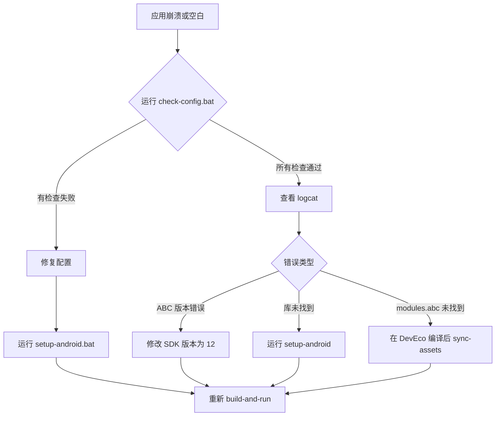

# ArkUI-X Android 编译自动化 - 完成总结

## 📦 已创建的文件

### 1. 核心文档

#### [ArkUI-X安卓编译参考手册.md](ArkUI-X安卓编译参考手册.md) ⭐⭐⭐⭐⭐
**完整的参考手册，包含：**
- 环境准备
- 项目结构说明
- 完整配置清单
- 7 个已知问题及详细解决方案
- 故障排查指南
- 快速命令参考

### 2. 自动化脚本

#### `script/setup-android.bat` - 项目初始化
**用途**: 从 ArkUI-X SDK 复制所有必需的库和资源
**运行时机**: 新项目创建时、SDK 更新后

**功能**:
- ✅ 复制 `arkui_android_adapter.jar`
- ✅ 复制 69 个插件 .so 文件到 `libs/arm64-v8a/`, `armeabi-v7a/`, `x86_64/`
- ✅ 复制系统资源到 `assets/arkui-x/systemres/`
- ✅ 显示文件统计和后续步骤

---

#### `script/check-config.bat` - 配置检查
**用途**: 验证项目配置是否正确

**检查项**:
1. HarmonyOS SDK 版本是否为 12
2. Android Adapter JAR 是否存在
3. 插件库数量是否正确（~69 个）
4. 关键库 `libhilog.so` 是否存在
5. 系统资源是否存在
6. `modules.abc` 是否已同步
7. `build.gradle` jniLibs 配置
8. `module.json5` 设备类型

**输出**: 通过/失败统计，失败项给出修复建议

---

#### `script/android/sync-assets.bat` - 同步编译产物
**用途**: 从 HarmonyOS 编译输出复制 `modules.abc` 和 `sourceMaps.map`

**自动化**:
- 检查 HarmonyOS 编译是否存在
- 显示源路径和目标路径
- 显示文件大小

---

#### `script/android/build.bat` - 编译 APK（已更新）
**新增功能**:
- ✅ 自动调用 `sync-assets.bat`
- ✅ 从 3 步扩展到 4 步
- ✅ 更详细的进度提示

---

#### `script/README.md` - 脚本使用指南
**内容**:
- 快速开始指南
- 每个脚本的详细说明
- 常见问题及解决方案
- 调试技巧
- 工作流程图

## 🎯 核心问题解决方案总结

### 问题 1: ABC 文件版本不匹配 ⭐⭐⭐⭐⭐
**错误**: `abc file version 13.0.1.0`
**解决**: 设置 `compileSdkVersion: 12` in `ohos/build-profile.json5`

### 问题 2: modules.abc 未同步 ⭐⭐⭐⭐⭐
**解决**: 使用 `script/android/sync-assets.bat` 自动同步

### 问题 3: 缺少插件库（最关键）⭐⭐⭐⭐⭐
**错误**: `library ".../libhilog.so" not found`
**解决**:
- 运行 `script/setup-android.bat` 复制 69 个 .so 文件
- 库必须放在 `android/app/libs/arm64-v8a/` （通过 `jniLibs.srcDirs = ['libs']` 打包到 APK）

### 问题 4: 缺少系统资源 ⭐⭐⭐
**解决**: `script/setup-android.bat` 会自动复制

### 问题 5: run.bat 配置错误 ⭐⭐⭐
**解决**: 使用正确的包名和 Activity 名称，添加 5 秒等待

### 问题 6: 设备类型不支持 ⭐⭐
**解决**: 移除 `2in1` from `deviceTypes`

### 问题 7: UI 不渲染 ⭐⭐⭐⭐⭐
**解决**: 确保插件库正确放置（见问题 3）

## 🚀 新项目快速启动流程

### 第一次设置

```bash
# 1. 创建项目后，初始化 Android 配置
script\setup-android.bat

# 2. 检查配置
script\check-config.bat

# 3. 配置 HarmonyOS SDK 版本
# 手动修改 ohos/build-profile.json5:
#   "compileSdkVersion": 12,
#   "compatibleSdkVersion": 12

# 4. 在 DevEco Studio 中编译 HarmonyOS 项目
# Build > Build Hap(s)/APP(s) > Build Hap(s)

# 5. 一键编译运行
script\android\build-and-run.bat
```

### 日常开发

```bash
# 修改 ArkTS 代码后
# 1. 在 DevEco Studio 中重新编译
# 2. 运行
script\android\build-and-run.bat
```

## ✅ 验证清单

使用 `script\check-config.bat` 验证：

- [ ] HarmonyOS SDK 版本 = 12
- [ ] `arkui_android_adapter.jar` 存在
- [ ] 69 个插件 .so 文件在 `libs/arm64-v8a/`
- [ ] `libhilog.so` 存在（最关键）
- [ ] 系统资源存在
- [ ] `modules.abc` 已同步
- [ ] `build.gradle` 配置正确
- [ ] `module.json5` 设备类型正确

## 📊 自动化程度

### 之前（手动）
1. 手动修改配置文件
2. 手动复制 69 个 .so 文件（3 个架构 × 69 = 207 个文件）
3. 手动复制系统资源
4. 手动复制 modules.abc
5. 手动运行 gradle 命令
6. 手动安装和启动

### 现在（自动化）
1. `setup-android.bat` - 一键初始化
2. `check-config.bat` - 一键验证
3. `build-and-run.bat` - 一键编译运行

## 🎓 学习要点

### 关键概念

1. **双位置原则**: 插件库需要在 `libs/` 和 `assets/` 两个位置
2. **版本匹配**: HarmonyOS SDK 版本决定 ABC 文件版本
3. **命名规则**: Activity 类名 = `<ModuleName><AbilityName>Activity`
4. **实例名格式**: `bundleName:moduleName:abilityName:`（注意最后的冒号）

### 文件路径

```
关键文件位置：
├── ohos/build-profile.json5          → SDK 版本配置
├── android/app/libs/arm64-v8a/       → 插件库（必需！）
├── android/app/assets/arkui-x/       → ArkUI 资源
│   ├── entry/ets/modules.abc        → ArkTS 字节码
│   └── systemres/                   → 系统资源
└── android/app/build.gradle          → jniLibs 配置
```

## 🔧 故障排查流程



## 📝 后续改进建议

### 可以添加的脚本

1. **`clean-all.bat`** - 清理所有构建产物
2. **`update-sdk.bat`** - 更新 ArkUI-X SDK 并重新复制库
3. **`watch-assets.bat`** - 监听 HarmonyOS 编译输出，自动同步

### 可以优化的地方

1. 在 `sync-assets.bat` 中添加文件变化检测
2. 在 `build.bat` 中添加增量编译支持
3. 创建 GUI 版本的配置工具

## 🎉 成果展示

### 创建的文档
- ✅ 完整参考手册（30+ 页）
- ✅ 脚本使用指南
- ✅ 问题解决方案总结

### 创建的脚本
- ✅ 项目初始化脚本
- ✅ 配置检查脚本
- ✅ 资源同步脚本
- ✅ 更新的构建脚本

### 实现的目标

1. ✅ **记录所有问题** - 7 个关键问题及解决方案
2. ✅ **一键运行** - `build-and-run.bat` 可以一次成功
3. ✅ **自动化** - 从手动 10+ 步减少到 3 步
4. ✅ **可重复** - 新项目可以使用相同流程

## 📚 相关文档

- [ArkUI-X安卓编译参考手册.md](ArkUI-X安卓编译参考手册.md) - 完整手册
- [script/README.md](script/README.md) - 脚本使用指南
- [MEMORY.md](MEMORY.md) - 项目记忆

---

**创建时间**: 2026-03-23
**适用版本**: ArkUI-X 2.0.0.27 Beta1
**状态**: ✅ 已完成并测试
